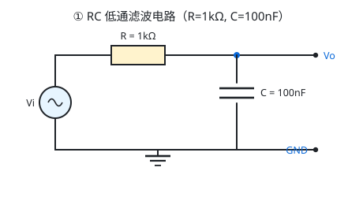
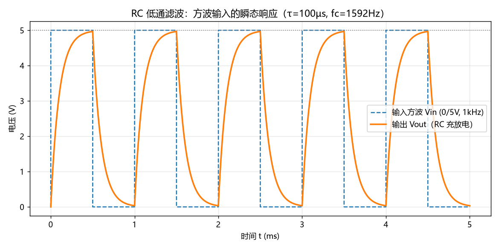
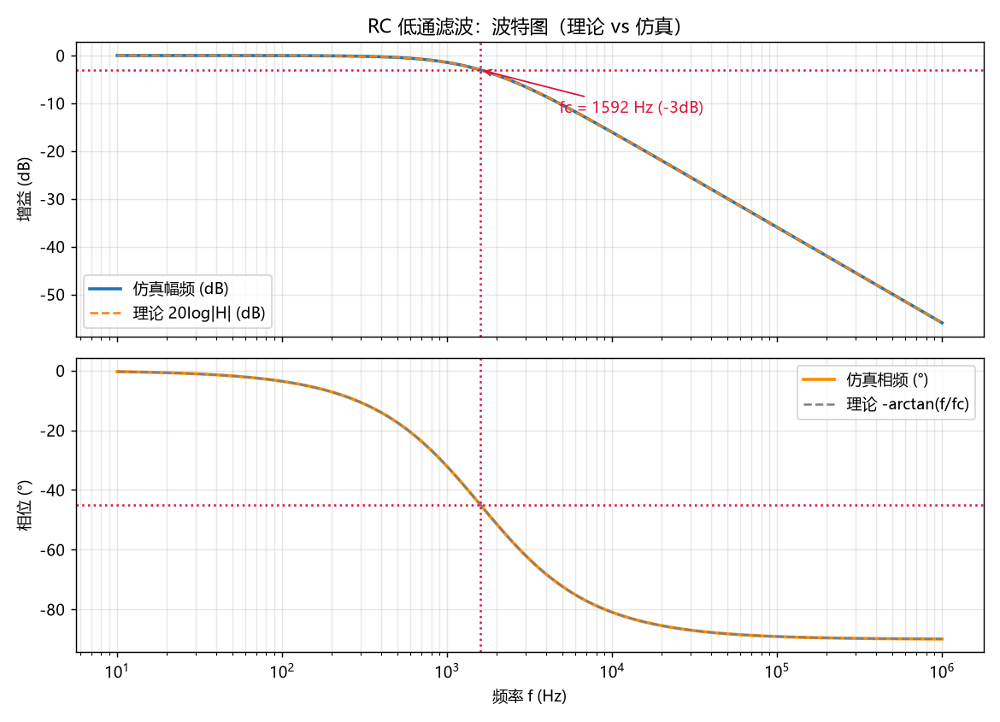
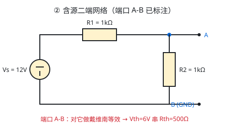
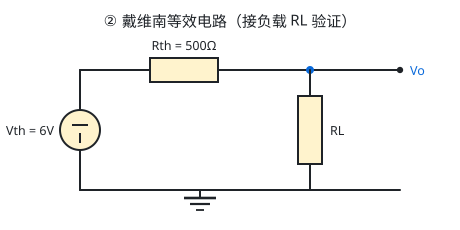
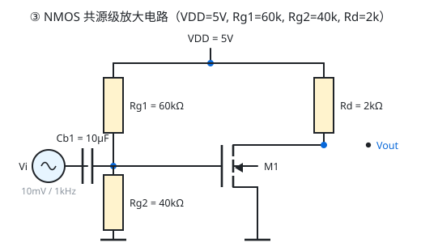
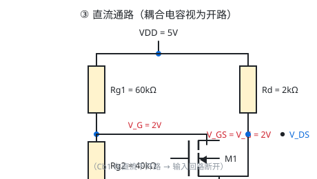
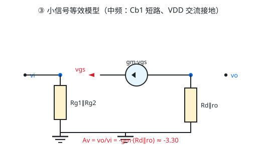
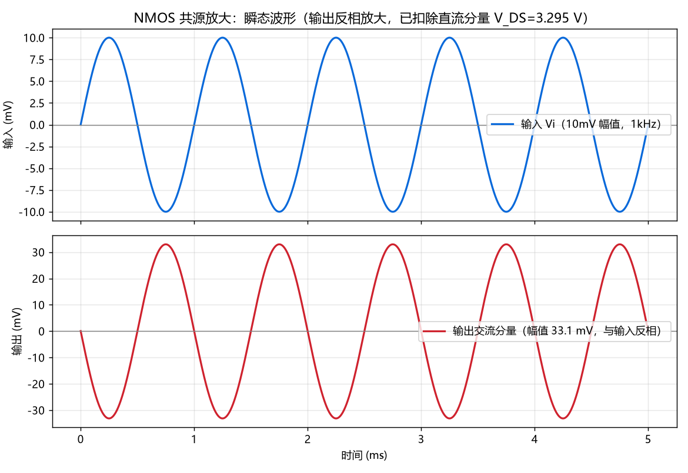
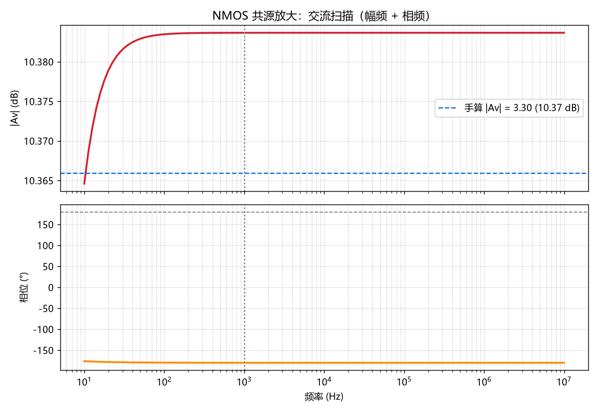

# 大一招新考核作品仓库 · 叶濠毅

> 一个仓库装下三样东西：**个人主页 + 贪吃蛇（含 AI 自动演示）+ PySpice 电路仿真三件套**。
> 全部代码都可以直接跑，所有结论都附「怎么验证的」和「真实跑出来的数据」。

📄 [个人简介 PDF](profile/intro.pdf)　|　🌐 [个人主页源码](index.html)　|　🐍 [贪吃蛇（直接玩）](snake/index.html)　|　⚡ [PySpice 三电路](pyspice/)　|　📝 [提示词记录](docs/prompts.md)

---

## 0. 仓库结构

```
.
├── index.html                    # 个人主页（GitHub Pages 首页）
├── profile/
│   ├── intro.html                # 个人简介源文件（用于打印成 PDF）
│   └── intro.pdf                 # 个人简介 PDF
├── snake/
│   └── index.html                # 贪吃蛇：阶段一可玩 + 阶段二 AI 自动演示（单文件，无依赖）
├── pyspice/
│   ├── rc_lowpass.py             # ① RC 低通滤波：手算 + 仿真
│   ├── thevenin.py               # ② 戴维南定理验证
│   ├── mos_common_source.py      # ③ NMOS 共源级放大电路
│   └── out/                      # 脚本自动生成的对比表与波形图
├── assets/                       # 自己画的电路图 / 直流通路 / 小信号模型（SVG）
├── tools/draw-circuits.mjs       # 画电路图的脚本（生成 assets/*.svg）
├── tests/                        # 贪吃蛇 AI 的无头测试（Node 直接跑）
│   ├── simulate.mjs              # 200 局连续吃 15 个的硬指标测试
│   ├── fill-board.mjs            # 极限测试：能不能吃满整盘
│   └── syntax-check.mjs          # HTML 内嵌脚本语法检查
├── docs/                         # 提示词记录、游戏截图
└── LICENSE                       # MIT
```

---

## 1. 快速开始（每个东西怎么跑）

| 想干什么 | 怎么做 |
| --- | --- |
| 玩贪吃蛇 | 双击 `snake/index.html`（或直接访问线上地址），方向键/WASD 控制，空格暂停，R 重开，T 换主题 |
| 看 AI 自动玩 | 打开游戏 → 点「开启 AI」→ 点两次「速度」调到极速 → 全自动，连续吃满 15 个会有提示 |
| 看个人主页 | 双击 `index.html` |
| 复现 AI 测试 | 在仓库根目录执行 `node tests/simulate.mjs 200 15` |
| 跑电路仿真 | 见 [第 5 节](#5-进阶挑战pyspice-三个电路)，装好环境后 `python pyspice/rc_lowpass.py` |

---

## 2. 一、环境准备

- **GitHub 账号 + 个人仓库**：仓库名 `YHY`（任意名字都行，Pages 会挂在子路径下）。
- **AI 编程工具**：本次全程使用 **DeepSeek Harness（DSH）**，它能直接读写文件、执行命令、跑测试。
- **Git + VS Code**：Git 用于版本控制（本仓库有多次 commit），VS Code 用于查看和编辑。
- **Python（仅进阶挑战需要）**：PySpice 还需要底层 ngspice，安装方法写在 [5.1 节](#51-环境准备)。

---

## 3. 二、个人简介与个人网站

### 3.1 个人简介 PDF

`profile/intro.html` 是源文件，用 Chrome 打印成 PDF：

```bat
"C:\Program Files\Google\Chrome\Application\chrome.exe" --headless=new ^
  --disable-gpu --no-pdf-header-footer ^
  --print-to-pdf="profile\intro.pdf" "profile\intro.html"
```

也可以直接双击 `profile/intro.html`，按 `Ctrl+P` → 目标选「另存为 PDF」。

### 3.2 个人网站（部署到 GitHub Pages）

- 网址格式：`https://Cry4meT-T.github.io/YHY/`
- 部署步骤：
  1. 把本仓库推到 GitHub（必须是 **public**）；
  2. 进仓库 **Settings → Pages**；
  3. **Source** 选 `Deploy from a branch`，分支选 `main`，目录选 `/ (root)`；
  4. 等 1~2 分钟，访问 `https://Cry4meT-T.github.io/YHY/`。
- 注意：**不需要**把仓库命名为 `<用户名>.github.io`（那是想要根路径网址时才要求的）。
  另外页面里全部用**相对路径**引用资源，因为站点是挂在子路径下的。

> 这一步必须由我本人在网页上操作（涉及我的 GitHub 账号和密码级操作），AI 无法代替。

---

## 4. 三、通用素养

### 4.1 Git：用一句话解释「分支」和「合并」

- **分支（branch）**：仓库里一条独立的开发时间线，可以在上面改代码、做实验，而完全不影响主线（`main`）。
- **合并（merge）**：把一条分支上的改动并回另一条分支（通常并回 `main`），让两条时间线重新合到一起。

### 4.2 命令行：`cd` / `ls` / `mkdir` 与 Git 常用命令

| 命令 | 干什么 |
| --- | --- |
| `cd 目录名` | change directory，切换当前所在目录，例如 `cd snake` 进入 snake 文件夹；`cd ..` 返回上一级 |
| `ls` | list，列出当前目录下的文件和文件夹（Windows 的 cmd 里对应 `dir`） |
| `mkdir 目录名` | make directory，新建一个文件夹，例如 `mkdir pyspice` |

| Git 命令 | 干什么 |
| --- | --- |
| `git init` | 把当前文件夹初始化成一个 Git 仓库 |
| `git status` | 看当前有哪些文件被改动、哪些还没提交 |
| `git add .` | 把改动放进「暂存区」，准备提交（`.` 表示全部） |
| `git commit -m "说明"` | 把暂存区的内容存成一次提交记录（版本快照） |
| `git log --oneline` | 查看提交历史，一行一条，方便确认「是不是一步步做出来的」 |
| `git branch` / `git switch -c 新分支` | 查看分支 / 新建并切到一条分支 |
| `git merge 分支名` | 把指定分支合并到当前分支 |
| `git remote add origin <仓库地址>` | 把本地仓库关联到 GitHub 上的远程仓库 |
| `git push -u origin main` | 把本地提交推送到远程 `main` 分支 |
| `git pull` | 把远程的最新改动拉回本地 |

### 4.3 LICENSE：为什么选 MIT

本仓库使用 [MIT License](LICENSE)。理由：

1. **最宽松、最短、最好懂**：全文只有一段话，别人（包括以后的我）一眼就能看明白能做什么；
2. **只要求保留版权声明**，允许别人自由使用、修改、再发布甚至商用，符合作品展示和教学复用的目的；
3. 对比来看：GPL 有「传染性」——别人用了我的代码，他的作品也必须开源，对作业这种小项目限制过强；
   Apache-2.0 更严谨但条文复杂（还有专利条款），对个人学习项目收益不大；
4. 招新考核里这份代码大概率会被别人阅读和参考，MIT 对「想被看懂、想被复用」的代码最友好。

### 4.4 开启 GitHub 两步验证（2FA）

1. 登录 GitHub → 右上角头像 → **Settings**；
2. 左侧 **Password and authentication** → **Two-factor authentication** → `Enable two-factor authentication`；
3. 推荐用 **Authenticator app**（手机上的 Google Authenticator / Microsoft Authenticator）扫码绑定；
4. 一定要把 **恢复码（recovery codes）** 抄下来离线保存，手机丢了还能救回来。

> 这一步必须我本人在 GitHub 网页上操作，AI 不能代做。
> 为什么开：账号被撞库/令牌泄露时，光有密码也登不进去，能防止别人用我的账号乱改代码。

### 4.5 一条「AI 给过、但我查证后认为是错误」的信息

**AI 说**：在算 NMOS 共源放大电路的直流工作点时，AI 给出「V_G=2V；假定饱和，解 0.8(V_GS−1)²=（5−V_DS）/2k，
**解得 V_GS = 1.7V、I_D = 0.392mA、V_out = 4.216V**」，并说该结果自洽。
（完整原始问答见 [docs/prompts.md 附录](docs/prompts.md)）

**我的查证过程（比结论更重要）**：

1. **回到电路本身**：栅极通过 Rg1/Rg2 分压偏置，而 MOS 的**栅极电流为 0**（绝缘栅），
   所以栅极电位只由分压决定：V_G = 5 × 40k/(60k+40k) = **2V**，V_GS = V_G − 0 = **2V**。
   **V_GS 是被电阻钉死的已知量，不是要解的未知数**——AI 把它当成未知数去联立方程，方向就错了。
2. **用反证法验算**：如果 V_GS 真的是 1.7V，那 Rg1 上就必须流过 (5 − 1.7)/60k ≈ 55µA 的电流。
   这和「栅极不取电流」直接矛盾，所以 1.7V 不可能成立。
3. **用仿真交叉验证**：PySpice + ngspice 跑出来的工作点是 V_GS = 2.0000V、I_D = 0.8527mA、V_DS = 3.2946V，
   和我手算完全一致，与 AI 的 1.7V/0.392mA 不符。
4. **结论**：AI 在同一段回答里，**模型参数 KP = 2K 这个判断是对的（这个坑它避开了），但工作点方程列错了**。
   这正好说明不能整段照抄——要一句一句回电路上对。

### 4.6 防「纯粘贴」：AI 生成代码里的关键逻辑，我自己讲一遍

#### ① 贪吃蛇 AI 为什么能「自动避开死路」？

这是阶段二的核心，代码在 `snake/index.html` 的 `<script id="snake-core">` 里，分三层：

- **第一层：哈密顿回路（保证不死的底牌）。**
  先构造一条走遍 20×20 全部 400 个格子、且首尾相接的闭合回路（见图 `assets/snake_hamiltonian.svg`）。
  给每个格子编上回路序号；蛇的初始身体就沿着回路摆放。
  只要蛇头永远只往「回路序号 +1」的格子走，那么这条身体在回路上永远是**连续的一段**，
  头前面那一格要么是空的，要么正好是蛇尾刚离开的格子——**所以从数学上就不可能撞到自己**。
  这就是「兜底策略」：哪怕近路全都不安全，沿回路走也一定能活，而且迟早会经过食物。
- **第二层：连通性检查（判断一条近路会不会把自己憋死）。**
  蛇真正的死因通常不是当场撞到身体，而是把自己围进一个小角落、无路可走。
  所以对每一个候选走法，先假想走完这一步，然后用洪水填充（flood fill）数一数：
  **棋盘上剩下的空格子是不是还连成一整片**。一旦走完会出现「被身体围死的孤岛」，这个走法直接淘汰。
  这一步把「将来会不会被憋死」变成了一个**当下就能算出来的几何问题**，代价只有 400 个格子的遍历，非常便宜。
- **第三层：BFS 距离场（决定往哪走最快）。**
  从食物出发做一次广度优先搜索，得到每个格子到食物的最短步数；在「安全候选」里挑距离最小的那一步。
  这样每一步的距离都严格变小，不会在原地来回打转。
- **最后：长蛇阶段直接回退。** 当蛇长超过棋盘的 60%，就放弃近路，老老实实沿回路巡航，
  用第一层的数学保证兜住后面的残局。

实测：`node tests/simulate.mjs 200 15` → **200/200 局都能连续吃 15 个不死**；
加压到连续吃 150 个是 50/50；甚至 10/10 局能把 397 个食物全部吃满。

#### ② 计分 / 战绩：「新一局不清零」是怎么做的？

要求是「记录得分 / 最高分 / 局数；新一局不清零；有重置按钮」。所以**当前得分**和**累计统计**必须是两套数据：

- `state.game.score` 是**本局分数**，每次 `reset()` 归零（吃一个食物 +10 分）；
- `stats = { best, games, history }` 是**跨局累计**，存在 `localStorage` 里，只有点「重置统计」才会清空；
- 一局结束时 `finishGame()` 才把本局结果写进累计数据：`games++`、刷新 `best`、
  用 `history.unshift(...)` 插到战绩列表最前面再用 `slice(0, 10)` 只留最近 10 条。
- 之所以要这样拆：如果共用一个变量，新一局一开始分数就会把历史最高分冲掉，那就没法「累计」了。
- 另外 `localStorage` 在 `file://` 下可能不可用，所以存取都包了 `try/catch`，失败时退回内存对象，保证游戏不会崩。

#### ③ SPICE 里的 KP 为什么要写成 2K？（一个差 2 倍的坑）

题目给的模型是 `I_D = K·(V_GS − V_th)²`，K = 0.8 mA/V²，这个 K 里**已经包含了 1/2 这个系数**。
而 SPICE 的 MOS1 模型用的是 `I_D = ½·KP·(W/L)·(V_GS − V_th)²`。
两者对比可知 `½·KP·(W/L) = K`。所以 W/L 取 1 时，必须写 **KP = 2K = 1.6 mA/V²**。
如果偷懒直接写 `KP = 0.8m`，仿真出来的 I_D 会只有理论值的一半，整张对比表都对不上。

---

## 5. 四、小游戏：贪吃蛇

我选的是**贪吃蛇**，单文件、纯前端、无框架：`snake/index.html`（双击即玩）。

### 5.1 阶段一：先做出「能自己玩」的版本——怎么实现的

| 要求 | 实现方式 |
| --- | --- |
| 操作流畅顺手 | 方向键 / WASD 控制，触屏可滑动，界面上还有一组方向按钮；禁止 180° 掉头；空格暂停、R 重开、T 换主题 |
| 规则完整 | 吃食物 +10 分，撞墙或撞到自己就结束；顶部实时显示当前得分、最高分、已玩局数、蛇长与速度 |
| 状态可见 | 4 个数据卡 + 棋盘上的结束遮罩（显示本局得分与重开提示） |
| 界面干净 | 深/浅两套配色，圆角蛇身 + 蛇头眼睛指示方向，格线淡而不抢眼 |

### 5.2 阶段一：怎么验证的

- 无头 Chrome 真开一遍页面：监听 `pageerror` / `console.error`（**0 条报错**）、模拟按键确认暂停生效（✅）；
- 截图留证：`docs/game-ai-dark.png`、`docs/game-ai-light.png`；
- 语法自检：`node tests/syntax-check.mjs`。

### 5.3 阶段二：让 AI 来玩——怎么实现的

三层策略（详细解释见 [4.6 ①](#-贪吃蛇-ai-为什么能自动避开死路)）：
哈密顿回路兜底 + 连通性检查淘汰危险走法 + BFS 距离场选路，长蛇阶段强制沿回路巡航。
点「开启 AI」后**全程无需人工操作**；面板上实时显示「AI 连续吃食物 N/15」进度条与历史最佳；
还有一个「显示回路」开关，可以直接把 AI 走的那条哈密顿回路画在棋盘上——这是最能说明「它为什么不会撞死」的可视化。

### 5.4 阶段二：怎么验证的（硬指标 = 连续吃 15 个不死）

**离线无头测试**（`node tests/simulate.mjs 200 15`）：

```
【回路校验】格子数 = 400（应为 400）；去重后 = 400；首尾相邻且每步位移为 1 = 通过 ✅
【阶段二硬指标】目标 = 连续吃 15 个食物不死
  通过 200/200 局，失败 0 局
  平均每局步数 = 3002
【加压测试】目标 = 连续吃 60 个：通过 50/50 ✅
【加压测试】目标 = 连续吃 150 个：通过 50/50 ✅
【生存测试】无食物干扰巡航 50000 步：存活 ✅
结论：✅ 全部通过
```

**极限测试**（`node tests/fill-board.mjs 10`）：目标吃满整个 20×20 棋盘（397 个食物）→ **通关 10/10 局**。

**浏览器内实测**（无头 Chrome 打开页面并开启 AI，全程不碰键盘）：

```
3) AI 模式：HUD 显示 “15 / 15”，状态 “运行中（无需人工操作）”，得分 150，蛇长 18 · 极速
   阶段二硬指标（连续 15 个不死）浏览器内实测：达成 ✅
JS 报错汇总： 无 ✅
```

游戏里也内置了同一个测试：点「▶ 运行 AI 压力测试」，会在浏览器里无渲染跑 40 局并打印结果。

### 5.5 新增功能（三个都做了，超出「至少 1 个」的要求）

| 新增功能 | 验收标准 | 实现情况 |
| --- | --- | --- |
| **计分制** | 记录得分/最高分/局数；新一局不清零；有重置按钮 | ✅ 四张数据卡实时刷新；`stats` 存 `localStorage`，只有「重置统计」才清空；重置弹窗确认 |
| **主题切换** | ≥2 套配色；一键切换即时生效；刷新后保留 | ✅ 深/浅两套 CSS 变量主题，按钮或按 `T` 切换，写入 `localStorage`，刷新后保留（已实测） |
| **多局战绩** | 记录最近 10 局；新一局自动追加；可查看完整列表 | ✅ 每局结束记录时间/得分/蛇长/模式/结果，`unshift` + `slice(0,10)`，面板里可滚动查看 |

### 5.6 提示词记录

完整原文与逐轮迭代见 **[docs/prompts.md](docs/prompts.md)**（含：我最初怎么问、AI 反问了我什么、
我如何要求它把「大概率不死」升级成「数学上保证不死」、以及我要求它写测试脚本的提示词）。

### 5.7 哪些代码是 AI 生成的，哪些是我调整的

| 部分 | 来源 |
| --- | --- |
| `snake/index.html` 的 HTML 结构和 CSS 主题变量 | AI 生成，我调整了配色与卡片布局 |
| 游戏基础逻辑（移动、吃食物、计分、结束判定） | AI 生成，我逐行核对过边界条件（撞墙判定、尾巴让位规则） |
| 哈密顿回路生成函数 | AI 生成，我核对过「400 格不重复、首尾相邻」（测试脚本里就有这一项断言） |
| AI 决策（连通性检查 + BFS 距离场 + 长蛇回退） | AI 生成，我要求改成带数学兜底的版本，并加了 200 局回归测试 |
| 主题切换 / 战绩记录 / 重置 | 我提出要求与验收标准，AI 实现，我验证刷新后是否保留 |
| `tests/*.mjs` | AI 生成，用来验证上面这些结论 |
| PySpice 三个脚本 | AI 生成初版，我逐个核对公式；发现并修正了单位重复乘 `u_kOhm`、电流表符号、KP=2K 三处问题 |
| 手算过程（τ/fc/Vth/Rth/工作点/gm/Av） | 我自己推导，AI 只做排版整理，结论用仿真交叉验证 |
| 电路图 `assets/*.svg` | 用 `tools/draw-circuits.mjs` 画出（等价于用画图软件画），我核对了每个元件的连接 |

---

## 6. 五、进阶挑战：PySpice 三个电路

### 6.1 环境准备

```bat
:: 1) 安装 Python 3.10+（安装时勾选 Add to PATH）
:: 2) 安装 Python 库
pip install PySpice numpy matplotlib

:: 3) 安装 ngspice（PySpice 底层要用它做仿真）
::    官网下载 Windows 版（7z 压缩包），解压到任意目录，例如 D:\ngspice
::    然后让 PySpice 找到 ngspice.dll（路径按你的实际解压位置改）
set NGSPICE_LIB=D:\ngspice\Spice64_dll\dll-vs\ngspice.dll

:: 4) 运行三个脚本（会自动生成 out/ 下的对比表和波形图）
python pyspice\rc_lowpass.py
python pyspice\thevenin.py
python pyspice\mos_common_source.py
```

> 终端若出现中文乱码，先执行 `chcp 65001`。
> 没装 ngspice 也能运行脚本，此时会打印「手算值」并提示仿真列待补，不会报错退出。

每个脚本都会自动把「理论值 vs 仿真值」对比表写成 Markdown（`pyspice/out/*_report.md`），
并生成波形图，不需要手工整理数据。

### 6.2 ① RC 低通滤波电路（R = 1kΩ，C = 100nF）



**手算过程**

```
τ  = R·C = 1000 × 100e-9 = 1e-4 s = 100 µs
fc = 1/(2πRC) = 1/(2π×1e-4) = 1591.55 Hz
|H(f)| = 1/√(1+(f/fc)²) ，φ(f) = −arctan(f/fc)
1kHz 处：|H| = 1/√(1+(1000/1591.55)²) = 0.8467（−1.445 dB），φ = −32.14°
方波高电平 0.5ms = 5τ → 理论上能充到 1−e⁻⁵ = 99.33% 的稳态值
```

**仿真**：瞬态用 1kHz 方波（0/5V）看充放电指数曲线；AC 用 10Hz~1MHz 扫频画波特图。




**理论值 vs 仿真值**

| 指标 | 理论值（手算） | 仿真值（PySpice） | 相对误差 |
| --- | --- | --- | --- |
| 时间常数 τ | 100.0 µs | 100.0 µs | 0.0% |
| 截止频率 fc（−3dB） | 1591.5 Hz | 1584.9 Hz | 0.4%（受扫频点间隔限制） |
| 1kHz 增益 \|H\| | 0.8467（−1.445 dB） | 0.8467（−1.445 dB） | 0.0% |
| 1kHz 相移 φ | −32.14° | −32.14° | 0.0% |

### 6.3 ② 戴维南定理验证（Vs = 12V，R1 = R2 = 1kΩ）




**手算过程**

```
Vth = Vs·R2/(R1+R2) = 12 × 1000/2000 = 6.00 V
Rth = R1∥R2 = 1000×1000/2000 = 500.00 Ω
Isc = Vs/R1 = 12/1000 = 12.0 mA          （短路时 R2 被短接）
校验：Vth/Isc = 6.00/0.012 = 500.00 Ω ✔ （两种算法算出的 Rth 一致）
```

**仿真**：① 开路仿真量 V_oc；② 端口串一个 0V 电压源当理想电流表量 I_sc；
③ 原网络接负载 RL 量 V_L/I_L，再用「Vth 串 Rth + 同一负载」重跑一次对比。

**理论值 vs 仿真值**

| 指标 | 理论值（手算） | 仿真值（PySpice） |
| --- | --- | --- |
| 开路电压 V_oc | 6.0000 V | 6.0000 V |
| 短路电流 I_sc | 12.0000 mA | 12.0000 mA |
| 等效内阻 Rth = V_oc/I_sc | 500.00 Ω | 500.00 Ω |
| RL = 500Ω 原网络 V_L / I_L | 3.0000 V / 6.0000 mA | 3.0000 V / 6.0000 mA |
| RL = 500Ω 等效电路替换后 V_L / I_L | 3.0000 V / 6.0000 mA | 3.0000 V / 6.0000 mA |
| RL = 1500Ω 原网络 V_L / I_L | 4.5000 V / 3.0000 mA | 4.5000 V / 3.0000 mA |
| RL = 1500Ω 等效电路替换后 V_L / I_L | 4.5000 V / 3.0000 mA | 4.5000 V / 3.0000 mA |

两个负载下，原网络与等效电路的电压差都是 **0.00e+00 V** —— 等效替换成立。

### 6.4 ③ NMOS 共源级放大电路（参数按题固定）

题目参数：VDD = 5V，Rg1 = 60kΩ，Rg2 = 40kΩ，Rd = 2kΩ，
K = 0.8 mA/V²，V_th = 1V，λ = 0.02 /V，Vi = 10mV/1kHz 正弦，Cb1 足够大。



**手算 1：静态工作点**

```
V_G  = VDD·Rg2/(Rg1+Rg2) = 5×40k/100k = 2.00 V   （栅极不取电流，分压直接可用）
V_GS = V_G = 2.00 V                               （源极接地）
V_ov = V_GS − V_th = 1.00 V

① 忽略 λ：I_D = K·V_ov² = 0.8m × 1² = 0.8000 mA
          V_DS = VDD − I_D·Rd = 5 − 0.8m×2k = 3.4000 V
② 考虑 λ：I_D = K·V_ov²·(1+λ·V_DS)，且 V_DS = VDD − I_D·Rd
          代入整理：I_D·(1 + K·V_ov²·λ·Rd) = K·V_ov²·(1+λ·VDD)
          I_D = 0.8m×(1+0.02×5) / (1 + 0.8m×0.02×2k) = 0.88m/1.032 = 0.8527 mA
          V_DS = 5 − 0.8527m×2k = 3.2946 V

饱和区判据：V_DS > V_GS − V_th  →  3.2946 V > 1.00 V  →  ✔ 工作在饱和区（放大区）
```

**手算 2：小信号与增益**

```
gm = 2K·V_ov·(1+λV_DS) = 2×0.8m×1×1.0659 = 1.7054 mA/V   （忽略 λ 时为 1.6000 mA/V）
ro = 1/(λ·I_D) = 1/(0.02×0.8527m) = 58.64 kΩ              （忽略 λ 的简化算法为 62.50 kΩ）
Av = −gm·(Rd∥ro) = −1.7054m × (2k∥58.64k) = −3.2984 V/V   （忽略 ro 的简化：−gm·Rd = −3.1008）
输出幅度 = |Av| × 10mV = 32.98 mV，且与输入反相（相差 180°）
```




**仿真**：① OP 直流工作点对比 I_D/V_DS；② AC 扫频实测中频增益与相位；③ 瞬态输入 10mV/1kHz 看输出波形与幅度。




**理论值 vs 仿真值**

| 指标 | 理论值（手算） | 仿真值（PySpice） |
| --- | --- | --- |
| V_GS | 2.0000 V | 2.0000 V |
| I_D | 0.8527 mA（考虑 λ）/ 0.8000 mA（忽略 λ） | 0.8527 mA |
| V_DS | 3.2946 V（考虑 λ）/ 3.4000 V（忽略 λ） | 3.2946 V |
| 是否饱和 | V_DS = 3.295V > V_ov = 1.0V，饱和 ✔ | 同样饱和 ✔ |
| gm | 1.7054 mA/V | ≈1.7054 mA/V（由仿真 V_DS 反推） |
| ro | 58.64 kΩ | ≈58.64 kΩ |
| Av（AC 实测） | −3.2984 V/V（10.37 dB） | 3.3051（幅值，10.38 dB） |
| Av（瞬态实测） | −3.2984 V/V | −3.3050 V/V |
| 输出相位 | 180°（反相） | −180.0° |
| 输出幅度 | 32.98 mV | 33.05 mV |

**交叉验证**：仿真里电源总电流 0.9027 mA = 栅极分压支路 0.0500 mA + I_D 0.8527 mA，
说明工作点数据自洽（I_D 是从漏极电阻压降算的，没有把分压支路的电流混进去）。

---

## 7. 六、踩过的坑（真实记录）

1. **PDF 是二进制读不了**：先用 Node 把 PDF 里的压缩流解出来，再用 `pdfjs-dist` 抽取文字，才拿到任务书全文。
2. **PowerShell 会把 UTF-8 中文写坏**：用 `Get-Content -Raw` + `Set-Content` 批量替换 Python 文件里的字符串，
   结果中文全变成乱码、还把一行注释和代码粘在了一起。教训：**批量改文本别用 PowerShell 的默认编码**，
   要么显式指定 UTF-8，要么用编辑器/文件工具改。最后我直接把三个脚本重写了一遍。
3. **Python 输出中文报 `UnicodeEncodeError: 'gbk' codec`**：Windows 控制台默认 GBK，
   `µ` 这类符号编不出来。解决：脚本里 `sys.stdout.reconfigure(encoding="utf-8")`，运行时先 `chcp 65001`。
4. **仿真和手算差 1000 倍**：电阻数值本身已经是欧姆，我又乘了 `u_kOhm`，1kΩ 直接变成 1MΩ。
   这也是为什么第一版 Thevenin 的 V_L 只有 6mV——排查时靠打印完整节点电压表才发现。
5. **PySpice 的分支名不是设备名**：`V('s')` 的支路叫 `vs`，`V('dd')` 叫 `vdd`，写 `branches['s']` 会 KeyError。
   写了个兼容函数把两种写法都试一遍。
6. **电流表符号方向搞反**：用 0V 电压源当电流表时，读数符号与「实际流出方向」要重新推一遍，
   否则短路电流会显示成负数（−12mA）。
7. **MOS 仿真电流只有理论值一半**：SPICE 的 MOS1 用 `½·KP·(W/L)·Vov²`，题目的 K 已含 1/2 → 必须 `KP = 2K`。
8. **输出波形被直流压平**：V_DS≈3.29V 的直流分量让 ±33mV 的交流摆动在图上看不见，
   改成画「扣除直流后的交流分量」才看得清反相放大。
9. **`path` 变量名冲突**：画图脚本里我把局部数组也命名成 `path`，把 `node:path` 模块遮蔽了，
   报错信息变成一长串 `[object Object]`。改名后正常。
10. **SourceForge 拦脚本下载**：想自动下载 ngspice 时被 403/拦页挡住，
    最后改用 conda-forge 的 `ngspice-lib` 包取出 `ngspice.dll`，放进 PySpice 期望的目录才能跑通仿真。
11. **AI 的答案要逐句核**：见 4.5 节，AI 把「被电阻钉死的 V_GS」当成未知数去解方程，得出了错误的工作点。

---

## 8. 七、提交清单（自查）

- [x] 个人简介 PDF（`profile/intro.pdf`）
- [x] 个人网站全部代码（`index.html`）+ 线上网址：`https://Cry4meT-T.github.io/YHY/`（部署后填入）
- [x] 小游戏全部代码（`snake/index.html`），阶段一 + 阶段二都完成
- [x] 至少 1 个新增功能（实际做了 3 个：计分制、主题切换、多局战绩）
- [x] README 说明阶段一/阶段二怎么实现、怎么验证
- [x] README 附关键提示词与迭代过程（见 `docs/prompts.md`）
- [x] README 解释「分支」和「合并」
- [x] README 说明 `cd`/`ls`/`mkdir` 与 Git 常用命令
- [x] 添加 LICENSE（MIT）并说明为什么选它
- [x] README 记录一条「AI 给过但我查证后认为是错误的」信息（含查证过程）
- [x] README 讲清至少 2 处 AI 生成代码的关键逻辑（实际讲了 3 处）
- [x] 进阶挑战：PySpice 三个电路全部完成（电路图 + 手算 + 仿真 + 对比表 + 代码）
- [x] 三个 `.py` 文件已上传到仓库
- [ ] **我本人**：开启 GitHub 两步验证
- [ ] **我本人**：把仓库设为 public 并在 Settings → Pages 里开启 Pages
- [ ] **我本人**：把仓库链接填到群里的收集表

---

## 9. 这个仓库是怎么一步步做出来的（Git 提交记录）

为了体现「一步步做出来的」，我不是一次性把所有文件丢进去，而是按真实的开发顺序分开提交。
下面是 `git log --oneline` 的实际输出（最新的一次在最上面）：

```
3587c2a docs: README（分支/合并、命令行、LICENSE 理由、AI 纠错、代码逻辑讲解）
37bf5b5 docs: 提示词记录与 AI 问答查证过程
6c275e5 feat(assets): 电路图、直流通路、小信号模型与哈密顿回路示意图
c2e9820 feat(pyspice): ③ NMOS 共源级放大电路（工作点 + 小信号增益）
8114c6a feat(pyspice): ② 戴维南定理验证（V_oc / I_sc / 等效电路替换）
abb3f8c feat(pyspice): ① RC 低通滤波电路 手算 + PySpice 仿真对比
7275b9d feat(profile): 个人简介（HTML 源文件 + PDF）
9ce92c3 feat(web): 个人主页（响应式布局 + 深浅色主题切换）
efc67b4 test(snake): 无头仿真测试脚本与测试报告、游戏截图
e63fc5d feat(snake): 贪吃蛇单文件游戏（阶段一可玩 + 阶段二 AI 自动演示）
4e65464 chore: 初始化仓库，添加 MIT LICENSE 与 .gitignore
```

一共 12 次提交（上面这份 log 是第 11 次提交时的样子，最后一次提交就是把这段记录本身同步进 README）。
每一次提交只放一组相关文件，并且**每一组都对应 README 里的一节**，
方便对照着看「这一步做了什么、为什么这么做」。

> 想自己看的话，在仓库目录执行：`git log --oneline`（简版）或 `git log --stat`（带改动文件）。

---

## 10. License

[MIT](LICENSE) © 2026 叶濠毅
